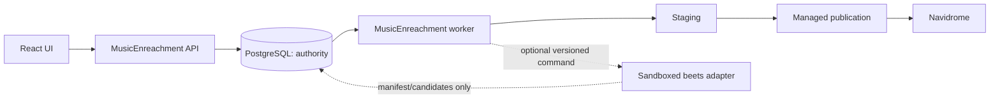

# Проект интеграции beets

Актуальность исследования: 11 августа 2026 года. Рассмотрен beets 2.13.1 и исходный код на коммите [`dc1709e`](https://github.com/beetbox/beets/commit/dc1709e14849adfec7208c53196dc2b01b5f3fd9).

## Краткий ответ

**Технически встроить beets можно, но делать его ядром MusicEnreachment сейчас не следует.**

Причина не в том, что beets является консольной программой. У него есть Python API для `Library`, `Item`, `Album`, запросов, плагинов и импортера. Проблема в другом:

- MusicEnreachment уже хранит в PostgreSQL более богатую модель: неизменяемые источники, стабильную идентичность, доказательства провайдеров, версии метаданных, историю публикаций, задания и события (`src/music_ingest/models/library.py:58`, `src/music_ingest/models/entities.py:24`).
- beets строится вокруг собственной SQLite-медиатеки и операций над файлами. Его документация прямо называет database API внутренним API ([Library Database API](https://beets.readthedocs.io/en/latest/dev/library.html)).
- встроенный web plugin является базовым локальным интерфейсом, не имеет встроенной аутентификации и не предоставляет стабильную расширяемую платформу для нашего UI ([web plugin](https://beets.readthedocs.io/en/latest/plugins/web.html), [source](https://github.com/beetbox/beets/blob/dc1709e14849adfec7208c53196dc2b01b5f3fd9/beetsplug/web/__init__.py#L272-L493)).
- импортёр блокирующий, интерактивные решения синхронны, публичного cancellation API и транзакционной отмены нет ([importer docs](https://beets.readthedocs.io/en/latest/dev/importer.html), [ImportSession](https://github.com/beetbox/beets/blob/dc1709e14849adfec7208c53196dc2b01b5f3fd9/beets/importer/session.py#L169-L242)).
- выполненная нами проба показала, что beets 2.13.1 работает на CPython 3.14.3, но строка, добавленная внутри root transaction до исключения, сохранилась после повторного открытия БД. На application-level rollback полагаться нельзя.

## Решение

### Сейчас

1. **Не добавлять beets как core dependency.**
2. **Не заменять PostgreSQL и текущий publication pipeline.**
3. Использовать beets как источник проверенных идей: синтаксис запросов, scoring, grouping, plugin ecosystem.
4. Продолжить развитие текущего UI вокруг собственной модели `LibraryRecord`, source evidence, metadata revisions и jobs.

### Когда появится конкретная потребность

Провести ограниченный proof-of-contract для одной операции:

- read-only discovery/grouping папки, добавленной вручную;
- либо сравнительный benchmark matching/scoring на репрезентативных fixtures.

Первый способ подключения: **изолированный subprocess**, а не долгоживущий управляющий сервис:

- отдельный `BEETSDIR` на задание;
- плагины отключены или явно разрешены;
- исходники смонтированы read-only;
- запрещены copy/move/write/delete;
- результат нормализуется в DTO MusicEnreachment и сохраняется как evidence;
- stdout и exit code не считаются достаточными подтверждениями успеха.

Долгоживущий управляющий сервис допустим только в том случае, если benchmark докажет необходимость сохранения состояния между заданиями, а его SQLite можно удалить и полностью восстановить как одноразовую производную проекцию.

## Карта документов

| Документ | Назначение |
|---|---|
| [integration-feasibility.md](integration-feasibility.md) | Возможности beets, сравнение моделей интеграции, риски и Go/No-Go |
| [target-architecture.md](target-architecture.md) | Границы данных, компоненты, job/decision protocol, consistency, recovery и миграция |
| [ui-and-roadmap.md](ui-and-roadmap.md) | UI-модель, экраны, состояния, пользовательские потоки и roadmap |

## Главная архитектурная граница



PostgreSQL остаётся источником истины. beets, если появится, возвращает предложения или может быть удалён вместе с одноразовой производной проекцией. Он не определяет идентичность, финальные теги, publish eligibility и состояние UI.

## Что можно переиспользовать отдельно

- Для tag I/O лучше рассматривать сам пакет [`mediafile`](https://github.com/beetbox/mediafile), а не `beets.mediafile`: последний является устаревшим re-export ([source](https://github.com/beetbox/beets/blob/dc1709e14849adfec7208c53196dc2b01b5f3fd9/beets/mediafile.py#L1-L13)).
- Низкоуровневые идеи `string_dist`, query parsing и templates можно перенять, но их небольшая ценность сама по себе не оправдывает зависимость от beets.
- Полный autotag, importer, duplicate workflow и path uniqueness зависят от глобальной конфигурации, плагинов и/или `Library`; их нельзя считать чистыми библиотечными функциями.

## Критический факт проверки

```text
Python: 3.14.3
beets: 2.13.1
SQLite: 3.51.2
basic Library add/query/reopen: passed
row added before exception inside root transaction: persisted after reopen
```

Следствие: любое будущее подключение должно быть идемпотентным, однописательным, проверяемым по постусловиям и восстанавливаемым повторным воспроизведением, а не распределённым rollback между PostgreSQL, SQLite и файловой системой.
