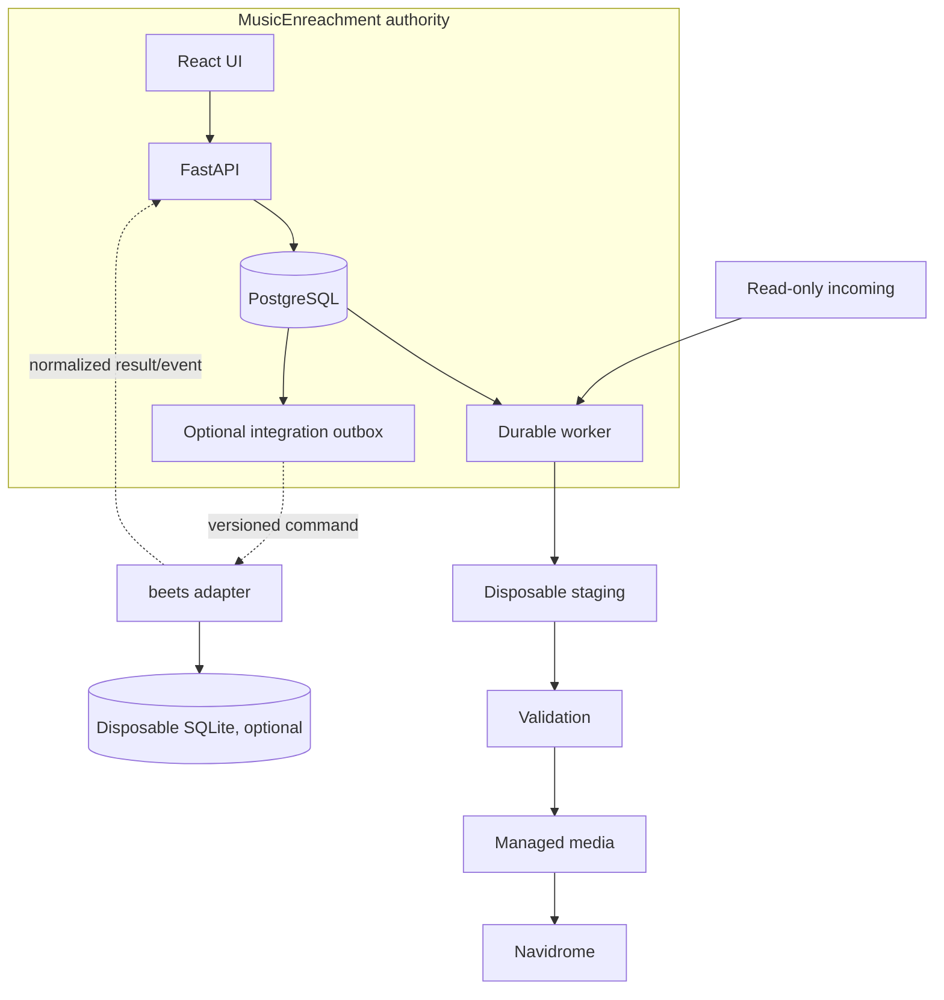
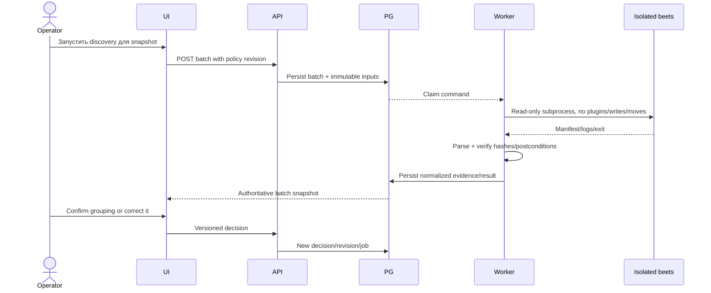

# RFC: целевая архитектура интеграции beets

Статус: **целевая архитектура необязательного адаптера; сам адаптер не является обязательным компонентом текущего релиза**.

## 1. Решение ADR

1. PostgreSQL остаётся единственным источником истины для domain identity, provenance, metadata revisions, review, jobs, events и publication history.
2. Incoming media остаётся read-only.
3. MusicEnreachment сохраняет ownership staging, validation и atomic publication.
4. beets не встраивается в FastAPI process.
5. Первый adapter, если benchmark capability подтвердит решение Go, реализуется как изолированный subprocess.
6. Долгоживущий управляющий сервис возможен только как одноразовая производная проекция с одним writer после отдельного ADR.
7. UI и публичный API никогда не выставляют `Library`, `Item`, `Album`, importer tasks или beets numeric IDs.

## 2. Контекст



На текущем этапе блок `beets adapter` отсутствует. Схема фиксирует место расширения, но не требует его реализации.

## 3. Компоненты

### 3.1 Existing authority plane

| Компонент | Ответственность |
|---|---|
| `LibraryRecord` | Стабильная track/composition identity и независимые state dimensions |
| `SourceRecord` | Неизменяемая source generation, path/inode/size/hash provenance |
| `LibraryMetadataRevisionRecord` | Append-only `original`, `analyzed`, `final` metadata |
| `LibraryPublicationRecord` | История materialized output с exact source/revision/hash |
| `LibraryEventRecord` | Объяснение state transitions |
| `JobRecord` / attempts | Durable scheduling, retries, lease, quarantine |
| publication service | Staging validation и atomic managed-media mutation |

Код: `src/music_ingest/models/library.py:58`, `src/music_ingest/models/entities.py:24`, `src/music_ingest/models/workflow.py:26`, `src/music_ingest/publication/service.py:51`.

### 3.2 Optional integration plane

Добавляется только после Go benchmark:

- `integration_commands`: immutable intent/outbox;
- `integration_attempts`: exact version/config/command, logs и checkpoint;
- `integration_results`: normalized manifest/candidates/projection receipt;
- `beets_links`: replaceable correspondence between current publication and observed beets IDs;
- `BeetsAdapter`: process execution, DTO parsing, timeout и postcondition verification;
- `IntegrationReconciler`: unknown outcomes, replay, drift и rebuild.

## 4. Источники истины и mapping

| Данные | Источник истины | Что может попасть в beets | Обратное направление |
|---|---|---|---|
| `LibraryRecord.id` | PostgreSQL | Namespaced foreign-key breadcrumb | Никогда не заменяется beets ID |
| `SourceRecord.id`, hash, origin | PostgreSQL | Только audit fields при необходимости | beets не меняет provenance |
| Incoming path | PostgreSQL observation + filesystem | Не является beets Item path | Нет |
| Recording/release MBID | Approved PostgreSQL identity | Item/Album metadata projection | beets mismatch становится drift evidence |
| Original/analyzed/final revisions | PostgreSQL | Только applied final values и revision ID | Manual beets edit не становится final автоматически |
| Publication path/hash/ID | PostgreSQL + managed file | Current Item path и audit keys | Read-back только для reconciliation |
| Job/attempt/event IDs | PostgreSQL | Только correlation in command/log | Не моделируются Item/Album fields |
| beets Item/Album IDs | Optional SQLite | Local IDs | Хранятся как replaceable observation |
| Plugin-local fields | beets/plugin | Только allowlisted exported values | Не canonical без PostgreSQL revision |

### Cardinality

- Один beets Album содержит несколько ориентированных на треки `LibraryRecord`.
- Одна текущая publication обычно соответствует одному beets Item.
- Несколько historical publications одного record не должны оставаться одновременно active Items, если это не отдельная product policy.
- beets `album_id` и `item.id` могут измениться после rebuild.

## 5. Командный контракт

Каждая внешняя операция начинается с immutable command:

```json
{
  "command_id": "integration-command-id",
  "idempotency_key": "operation:publication-or-batch:revision",
  "kind": "discover_groups",
  "record_id": null,
  "source_ids": ["source-id"],
  "publication_id": null,
  "metadata_revision_id": null,
  "input_snapshot": {
    "paths": ["/readonly/incoming/album"],
    "sha256": ["..."]
  },
  "runtime": {
    "beets_version": "2.13.1",
    "plugins": [],
    "config_digest": "..."
  },
  "requested_at": "RFC3339 timestamp"
}
```

В production DTO поля типизированы и разделены по `kind`; generic JSON показан только как пример формата передачи.

### Обязательные свойства

- command immutable;
- retry использует тот же idempotency key;
- input paths и hashes фиксируются до запуска;
- version/config/plugins сохраняются с attempt;
- результат не считается успешным только на основании exit code;
- неизвестный outcome переходит в reconciliation, а не blind retry.

## 6. Result protocol

Adapter возвращает application-owned DTO:

```text
DiscoveryResult
  command_id
  input_snapshot_digest
  groups[]
    group_key
    source_ids[]
    inferred_album_fields
    warnings[]
  rejected[]
  tool_version
  config_digest
```

Для matching result дополнительно нужны candidate identity, normalized fields, score components и source provenance. Изменяемые `ImportTask` и объекты плагинов не пересекают границу.

## 7. Полный процесс необязательного discovery/grouping



После этого текущий MusicEnreachment pipeline продолжает выполнять inspection, matching, review и publication. beets не добавляет записи в canonical library.

## 8. Если появится projection mode

Projection mode является более дорогим отдельным уровнем:

```text
PostgreSQL final revision + approved publication
  -> outbox command
  -> one beets writer
  -> Item/Album projection
  -> read-back receipt
  -> PostgreSQL projection status
```

### Состояния доставки

- `pending`
- `running`
- `pending_confirmation`
- `succeeded`
- `failed_retryable`
- `failed_terminal`
- `cancel_requested`
- `outcome_unknown`
- `reconciling`
- `superseded`

`outcome_unknown` обязателен: process/service мог применить изменение, но acknowledgement потерян.

## 9. Consistency model

Распределённой транзакции PostgreSQL + SQLite + filesystem нет.

Применяется **transactional outbox + idempotent consumer + reconciliation**:

1. PostgreSQL фиксирует domain state и integration intent в одной транзакции.
2. Writer выполняет одну bounded operation.
3. Receipt содержит observed postconditions.
4. Повторная доставка распознаётся по namespaced IDs/hash/revision.
5. Конфликт не исправляется молча; создаётся drift event/task.

### Failure matrix

| Failure | Состояние | Recovery |
|---|---|---|
| PG commit, adapter не запущен | `pending` | обычный retry |
| Adapter изменил SQLite, receipt не записан | `outcome_unknown` | read-back reconciliation, не повторный import |
| Result получен, PG временно недоступен | попытка сохраняет ключ команды и артефакты | повторная result delivery |
| Source изменился после snapshot | `source_changed` | новая source generation, old decision stale |
| Publication revision superseded | `superseded` | новый command для новой revision |
| SQLite удалена | projection unavailable | deterministic rebuild или No-Go |
| Plugin side effect unknown | `manual_reconciliation_required` | plugin-specific runbook; plugin не допускается без него |

## 10. Transaction rule

Нельзя предполагать откат транзакции beets при исключении. Наша проверка показала сохранение мутации после исключения; текущий исходный код показывает unconditional commit на root exit ([source](https://github.com/beetbox/beets/blob/dc1709e14849adfec7208c53196dc2b01b5f3fd9/beets/dbcore/db.py#L925-L952)).

Правила adapter:

- одна логическая mutation на command;
- preflight перед mutation;
- postcondition read-back;
- no catch-and-continue внутри beets transaction;
- application compensation вместо обещания rollback;
- crash injection tests для каждого checkpoint.

## 11. Concurrency

- Ровно один mutating beets writer.
- API не открывает свою mutating `Library`.
- Read operations не принимают решения о canonical state.
- SQLite и media root находятся на local filesystem, не NFS/SMB.
- Migration запускается в maintenance phase без второго beets process.
- CPU/network analysis может выполняться параллельно только над immutable snapshots; результат возвращается writer/application.

Обоснование: beets сериализует корневые транзакции на уровне процесса, а filesystem path selection и model state не защищены SQLite locks ([db source](https://github.com/beetbox/beets/blob/dc1709e14849adfec7208c53196dc2b01b5f3fd9/beets/dbcore/db.py#L1107-L1195)).

## 12. Профиль изолированного subprocess

Минимальные требования:

| Boundary | Requirement |
|---|---|
| Config | per-job `BEETSDIR`, explicit library/directory/state/log paths |
| Plugins | `--plugins=` либо exact allowlist |
| Filesystem | input read-only; output только в dedicated temp root |
| Network | disabled unless selected capability explicitly needs provider access |
| Mutations | default `-C -M -W`; destructive commands запрещены |
| Process | timeout + terminate process group |
| Evidence | command, environment, stdout, stderr, result artifact, postcondition |
| Security | paths normalized against allowed roots; no user-controlled command fragments |

`-c` сам по себе недостаточен, потому что beets сначала читает user config и затем накладывает явно указанный файл ([source](https://github.com/beetbox/beets/blob/dc1709e14849adfec7208c53196dc2b01b5f3fd9/beets/ui/__init__.py#L910-L935)).

## 13. Projection rebuild contract

SQLite считается disposable только если из PostgreSQL и approved files восстанавливаются:

- canonical fields;
- explicit album membership/order;
- MBIDs и reconciliation IDs;
- published paths и byte hashes;
- allowlisted flexible fields;
- exact runtime/plugin/config manifest.

Не учитываются при сравнении:

- numeric Item/Album IDs;
- `added`, filesystem-derived `mtime`;
- importer prompts/choices;
- unexported flexible fields;
- plugin caches/private tables;
- external side effects.

Rebuild проходит offline, без autotagging, без side-effect plugins и без tag rewrite. Если продукту нужна точная сохранность перечисленного beets-local state, projection mode получает No-Go.

## 14. Backup и recovery

Нужны отдельные резервные копии:

1. PostgreSQL с domain history и integration commands/results;
2. managed media и sidecars;
3. runtime/plugin/config manifest;
4. optional SQLite snapshot только для быстрого восстановления, но не как единственная копия.

Recovery acceptance:

- удалить SQLite;
- восстановить дважды из одного fixture;
- сравнить normalized exports без local IDs/timestamps;
- проверить hashes и grouping;
- reconciliation создаёт новые replaceable beets links;
- network call во время rebuild считается ошибкой.

## 15. Security

- Official web plugin не разворачивается наружу.
- Browser обращается только к existing authenticated MusicEnreachment API boundary.
- beets path/media endpoints не экспонируются.
- Secrets не попадают в command/log/result.
- Third-party plugins запрещены по умолчанию.
- Каждый plugin требует license audit, field/event inventory, side-effect map и recovery test.

## 16. Compatibility suite

Для каждой версии-кандидата beets:

1. Python import/version gate.
2. Basic isolated command or Library smoke.
3. Проверка реального transaction behavior.
4. DTO normalization fixture.
5. Prompt-free execution fixture.
6. Plugin allowlist fixture.
7. Duplicate delivery/idempotency.
8. Crash before and after external commit.
9. Delete-SQLite rebuild.
10. Representative media/grouping benchmark.

Upgrade разрешён только после green suite на candidate version. Open typing work и future v3 migrations отслеживаются, но unreleased API не используется ([typing issue](https://github.com/beetbox/beets/issues/6921), [plugin migration](https://beets.readthedocs.io/en/latest/dev/plugins/autotagger.html#migration-guidance)).

## 17. Migration текущей медиатеки

При текущем решении миграция не требуется.

Если projection mode получит Go:

1. Export current publications из PostgreSQL.
2. Verify every path/hash/revision.
3. Group explicitly by release MBID или approved fallback.
4. Build empty disposable beets DB с plugins disabled.
5. Apply canonical fields из PostgreSQL, не выполнять autotag.
6. Persist observed Item/Album links.
7. Compare normalized projection с manifest.
8. Enable incremental outbox delivery.
9. Keep destructive beets operations disabled.

Откат внедрения означает удаление adapter/projection и SQLite. Canonical MusicEnreachment state не меняется.

## 18. Open implementation decisions

Эти решения принимаются только после выбора capability:

- exact command/result DTO для discovery или matching;
- subprocess parsing strategy без stdout prose;
- album fallback key при отсутствии release MBID;
- exact checkpoint, после которого cancellation становится reconciliation;
- plugin-specific fields и side effects;
- benchmark threshold, оправдывающий dependency.

Это не пробелы feasibility: без выбранной операции конкретизировать их преждевременно.
